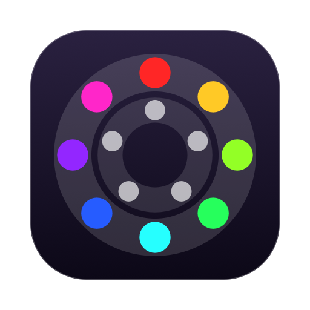
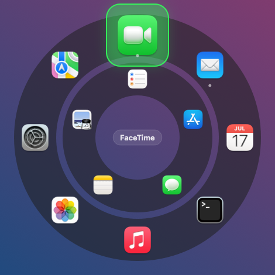
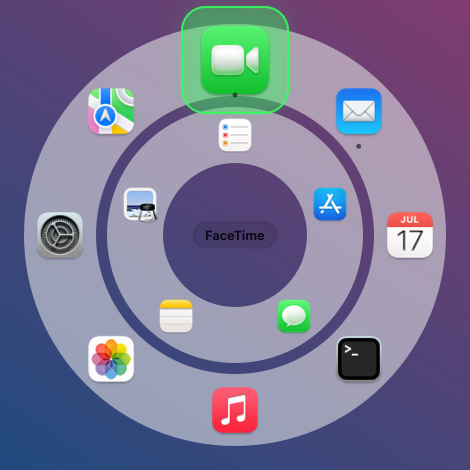
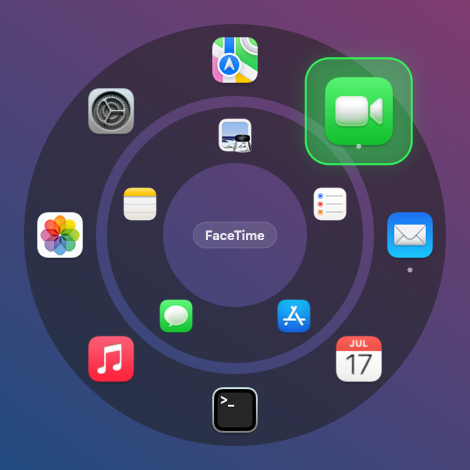
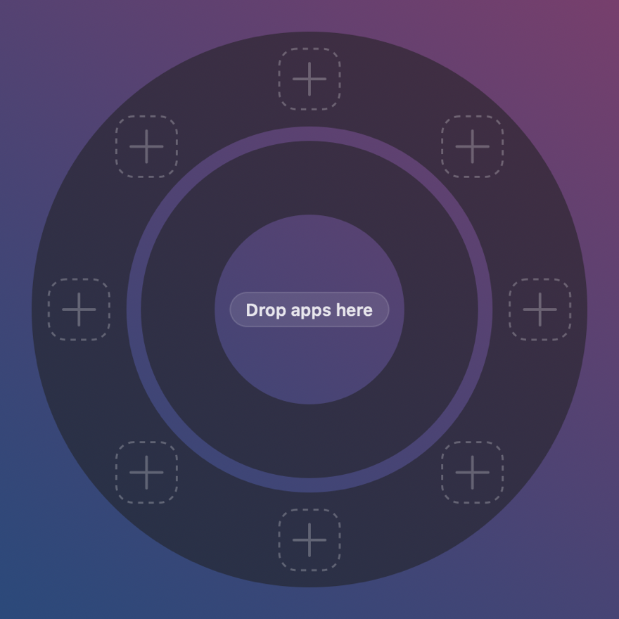
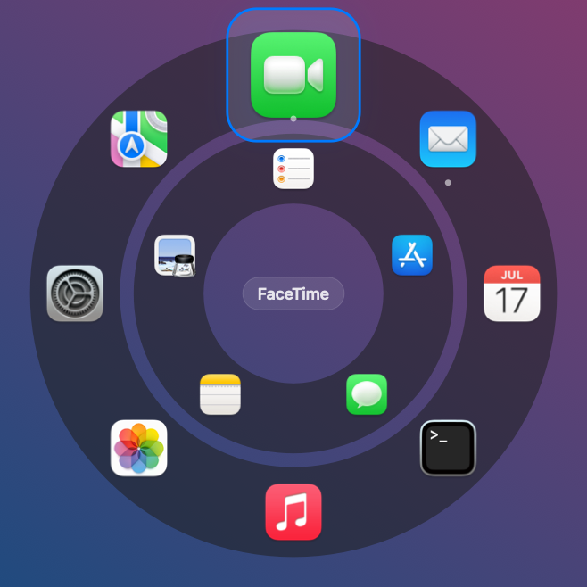

<div align="center">



# Chakra

**A radial application launcher for macOS.**
Press a shortcut or click a floating orb, and a ring of your apps opens where you are
looking. Flick towards one and it launches.

[](https://github.com/RudraMind/Chakra-Mac/actions/workflows/ci.yml)
[](https://github.com/RudraMind/Chakra-Mac/releases/latest)
[](https://github.com/RudraMind/Chakra-Mac/releases)
[](LICENSE)




*The wheel screenshots are real output from `./render-preview.sh`, resized for the web — not
mockups. The icon above is generated by `make-icon.sh`.*

</div>

---

## The idea

Your apps sit at **fixed positions on a ring**, so a slot's place becomes muscle memory.
You stop reading icons and start flicking in a direction.

```
                          ▲ 12 o'clock = slot 0
                    ╭─────┴─────╮
                ╭───╯           ╰───╮
             ╭──╯   ◍   ◍   ◍   ◍    ╰──╮        ◍  outer ring: 4–10 apps you pin
            │    ◍      ▁▁▁▁▁      ◍    │            (fixed positions, muscle memory)
            │       ◍ ╱       ╲ ◍       │
            │        │  ○ ○ ○  │        │        ○  inner ring: 0–7 live recents
            │        │ ○   ▒ ○ │        │            (▒ = the see-through hole)
            │       ◍ ╲       ╱ ◍       │
            │    ◍      ▔▔▔▔▔      ◍    │
             ╰──╮   ◍   ◍   ◍   ◍    ╭──╯
                ╰───╮           ╭───╯
                    ╰───────────╯
```

Indices run **clockwise from twelve o'clock**, so a slot's position is stable and learnable.
Both rings can be turned and will stay where you leave them.

---

## What makes it unusual

### It asks for no permissions. Ever.

No Accessibility. No Screen Recording. No Automation prompt. That single constraint drove
two API choices in the app, each one away from the obvious call:

| The usual way | What Chakra does instead | Why |
|---|---|---|
| `NSEvent.addGlobalMonitorForEvents` | Carbon `RegisterEventHotKey` (`Sources/HotKey.swift`) | The former makes macOS demand Accessibility. The latter needs nothing. |
| A global monitor to record a shortcut | A **local** monitor (`Sources/SettingsWindow.swift`) | The app is frontmost while recording anyway. |

A third choice sits in the **install script**, not the app: `build.sh --install` uses
`pkill -x Chakra` to replace a running copy, rather than AppleScript, which would trigger an
Automation prompt. Worth knowing that it is a build-time convenience — the app itself never
quits anything. A second launch detects the first over `DistributedNotificationCenter` and
simply exits (`Sources/main.swift`).

### It makes no network connections

No analytics. No crash reporting. No licence check. No update check. There is no networking
code in the project at all — you can confirm it in one command:

```bash
grep -rniE "URLSession|http://|https://|CFSocket" Sources/ Tools/    # returns nothing
```

The only frameworks imported are `AppKit`, `Carbon`, `CoreGraphics`, `CoreServices`,
`Foundation`, `ServiceManagement` and `UniformTypeIdentifiers` — all of which ship with
macOS.

### It has no dependencies and no project file

No SwiftPM, no Xcode project, no third-party code. Six shell scripts drive `swiftc`
directly and assemble the `.app` bundle by hand. The app icon is **generated** by
`make-icon.sh` from Swift source rather than drawn by hand. The icon is generated, not
committed. `build.sh` rebuilds it when it is missing or older than `Tools/MakeIcon.swift`.

---

## The orb

A 56pt disc that floats above every app, on every Space, and over full-screen apps. Drag it
anywhere. Leave it near a screen edge and it slides 62% of the way off, leaving a sliver to
point at.

```
    idle, mid-screen        tucked at the right edge      pointed at again
    ┌──────────────┐        ┌──────────────┐             ┌──────────────┐
    │              │        │              │             │              │
    │      ◕       │        │             ◖│             │           ◕  │
    │   35% alpha  │        │  62% off →   │             │  slides back │
    └──────────────┘        └──────────────┘             └──────────────┘
```

The dots on its face are the **dominant colours of the apps on your outer ring, in ring
order**, with slot 0's dot drawn larger so the orb always shows which way is up.

---

## Screenshots

<table>
<tr>
<td width="50%" align="center">

<br><b>Hovered</b><br>
<sub>The icon grows 1.5× and gains a plate. The name appears in the middle.</sub>
</td>
<td width="50%" align="center">

<br><b>Light glass</b><br>
<sub>Glass opacity and tint are both adjustable.</sub>
</td>
</tr>
<tr>
<td width="50%" align="center">

<br><b>Turned</b><br>
<sub>Scroll over a ring to turn it. It snaps to the nearest slot and stays there.</sub>
</td>
<td width="50%" align="center">

<br><b>First run</b><br>
<sub>Empty slots, before you pin anything.</sub>
</td>
</tr>
</table>

### The size range, at true relative scale

The size slider runs from **0.7× to 1.4×**, so the largest setting is exactly twice the
smallest. These two are shown at their real ratio rather than stretched to equal width —
otherwise the comparison would show nothing at all.

<p align="center">

&nbsp;&nbsp;&nbsp;&nbsp;

<br>
<sub><b>0.7×</b> — small enough to stay out of the way &nbsp;·&nbsp; <b>1.4×</b> — the largest the slider offers</sub>
</p>

---

## Install

### Download a release

1. Download **[`Chakra.dmg`](https://github.com/RudraMind/Chakra-Mac/releases/latest)** from the
   Releases page.
2. Open it. A window appears with the app on the left and an **Applications** shortcut on
   the right — drag `Chakra.app` onto it.

   ```
    ┌────────────────────────────────┐
    │  Chakra 1.0                    │
    │                                │
    │     ◉   ──────drag─────▶  📁   │
    │   Chakra              Applications
    │    .app                        │
    └────────────────────────────────┘
   ```

3. Eject the disk image and launch Chakra from Applications.
4. **The first launch will be blocked.** This is expected — see below.

<details open>
<summary><b>⚠️ macOS will refuse to open it the first time. Here is how to get past that.</b></summary>

<br>

macOS will refuse to open it with a dialog titled **"Chakra" Not Opened**, saying
*"Apple could not verify "Chakra" is free of malware that may harm your Mac or compromise
your privacy."* The dialog offers only **Done** and **Move to Trash** — there is no Open
button.

**That warning is accurate.** Chakra is *ad-hoc signed* rather than notarized, because
notarizing requires a paid Apple Developer account this project does not have. Apple has
not inspected the app. You are choosing to trust this repository instead.

To allow it:

1. **Dismiss the block dialog** with **Done** (not Move to Trash).
2. **Open System Settings → Privacy & Security**, and scroll down to the **Security** section.
3. **Click "Open Anyway"** beside the blocked-app notice. This button is available for about
   an hour after the blocked launch attempt; after that it disappears and you must retry step
   1 first.
4. **Confirm "Open"** in the re-prompt, then enter your login password.

You only need to do this **once per build**.

**Verify what you downloaded** against the SHA-256 published in the release notes:

```bash
shasum -a 256 ~/Downloads/Chakra.dmg
```

> The download is named `Chakra.dmg` for every release, so the link never changes. To tell
> which version a copy is, open it — the window title shows `Chakra 1.0`, and the checksum
> file on the release page records the version too.

**Prefer not to extend that trust?** Build it yourself — that is exactly why the build is
six readable shell scripts with no dependencies. See below.

</details>

### Prove the download really came from this repository

One command, and it is stronger than a checksum. It needs the
[GitHub CLI](https://cli.github.com) and a login — `gh attestation verify` requires a token
even for a public repository:

```bash
gh auth login                                                    # once, if you never have
gh attestation verify ~/Downloads/Chakra.dmg --repo RudraMind/Chakra-Mac
```

Expect `✓ Verification succeeded!`. This is a [Sigstore](https://www.sigstore.dev/) build
attestation produced by this repo's own CI — it proves the disk image was built **by this
repository, from a specific commit**, and cannot be forged by anyone without control of the
repository.

Note what it does *not* do: **macOS never checks it**, so the first-launch warning appears
either way. It only helps someone who runs the command.

**[`VERIFYING.md`](VERIFYING.md) explains every level of checking in plain terms** — checksum,
build provenance, signed commits, and building from source so you need trust nobody at all.

### Or build from source

```bash
git clone https://github.com/RudraMind/Chakra-Mac.git
cd Chakra
./build.sh                  # → build/Chakra.app
cp -R build/Chakra.app /Applications/
# or in one step:
./build.sh --install
```

Nothing to install first beyond the Xcode command line tools
(`xcode-select --install`). No package manager. No `pod install`. No project to open.

### Requirements

| | |
|---|---|
| **macOS** | 14 (Sonoma) or later |
| **Architecture** | Universal — Apple silicon and Intel. Verified: `lipo -archs` on the shipped binary reports `x86_64 arm64`. |
| **Permissions** | **None.** Not one. |
| **Network** | Never used |

> **For contributors on an Intel Mac:** the shipped **app** is universal, but the development
> scripts are not. Only `build.sh` builds for both architectures; `run-tests.sh`,
> `run-smoke.sh`, `render-preview.sh`, `make-icon.sh` and `dump-icons.sh` each hardcode
> `-target arm64-apple-macos14.0`, so on Intel they compile a binary that cannot run. Building
> and *using* Chakra works on Intel; running its test suite does not, until those five lines
> use the host architecture. Tracked as a known limitation, not a design choice.

---

## Use it

| Do this | Get this |
|---|---|
| `⌥Space` (configurable) | The wheel opens where you chose — pointer, a saved spot, or screen centre |
| Click the orb | Same |
| Click the menu-bar icon | Same |
| Click an app | Launches it |
| `⌥`-click an app | Quits it |
| Right-click an outer app | Removes it from the ring |
| Scroll over the wheel | Turns that ring; it snaps to the nearest slot |
| Number keys, arrows, `Return`, `Esc` | Keyboard control. Digits map to outer slots, so the usable range follows your slot count — `1`–`8` at the default of 8, `1`–`4` if you set 4. With 10 slots the tenth is not reachable by digit. |
| `Tab` | Switches which ring the keyboard is driving |
| Drag an app onto the orb or the menu-bar icon | Adds it to the first free slot |
| Drag an inner app onto an outer slot | Pins it there |
| Drag the hole in the middle | Moves the whole wheel |

---

## Settings

**Nineteen settings you can change** from the Settings window: 4–10 outer slots, 0–7 inner,
wheel size, glass opacity and tint, where the wheel opens, the shortcut, whether the wheel
spins on open, scroll-to-spin, colourful highlights, whether the app shows in the Dock, and
for the orb — shown or not, size, idle dimness, edge tucking, and hidden-from-screen-recording.

Chakra stores **30 preference keys** in total. The other eleven are not settings: two hold your
data (the pinned ring and the recents list) and nine are internal state the app manages
itself — whether onboarding has run, the saved wheel position, ring rotation, and where the orb
sits on which display.

**Every value is clamped and type-checked on read** — and `isFinite` is checked *before*
clamping, because NaN compares false with everything and would otherwise slip straight
through `min`/`max`. A hand-edited or corrupted preferences file cannot produce a broken
window. One exception worth naming: `orbDisplayName` is read as an unbounded string with no
clamp, because it is only ever used as a label.

**The outer ring always keeps at least 3 apps.** A removal that would drop below three is
refused and the Clear buttons grey out. A ring with one app in it is not a ring, because
"flick in a direction" stops meaning anything.

---

## Develop

```bash
./run-tests.sh        # 2,136 checks, pure logic, no window server needed
./run-smoke.sh        # 558 checks, builds real windows — needs an unlocked screen
./build.sh            # universal, zero warnings
./render-preview.sh   # renders the wheel to PNG without opening a window
./make-dmg.sh         # packages build/Chakra.app into build/Chakra.dmg
```

All six **build** scripts use `-warnings-as-errors`, so a warning is a build failure.
`make-dmg.sh` compiles nothing — it is packaging only, and uses `hdiutil`, which ships with
macOS, so it needs no third-party tool and runs on a clean CI runner.

> **`run-smoke.sh` fails completely on a locked screen.** The window server refuses to move
> windows, so every orb-tuck check fails and it looks exactly like a broken animation.
> There is a guard that says so — believe it when it fires.

The test framework is hand-rolled (`Tests/TestMain.swift`), **not XCTest**, because XCTest
requires Xcode and this project builds with `swiftc` alone.

### Where to read

| File | For |
|---|---|
| [`CLAUDE.md`](CLAUDE.md) | The one-minute orientation. Start here. |
| [`ai/ARCHITECTURE.md`](ai/ARCHITECTURE.md) | What every type owns, and how a click becomes a launched app |
| [`ai/GEOMETRY.md`](ai/GEOMETRY.md) | Diagrams of the wheel and orb, with every real number |
| [`BUILD-CHAKRA.md`](BUILD-CHAKRA.md) | The complete record — every decision, failure and resolution |
| [`CONTRIBUTING.md`](CONTRIBUTING.md) | The four rules, and the two habits that found most of the bugs |
| [`VERIFYING.md`](VERIFYING.md) | How to check this build really came from here — and what cannot be proven |
| [`SECURITY.md`](SECURITY.md) | The no-permissions, no-network posture, and how to report a problem |

---

## Known limitations

Stated plainly, because finding them out after installing is worse.

- **Ad-hoc signed, not notarized.** The first launch is blocked (see Install). And because
  the signature is ad-hoc, macOS treats **every rebuild as a different program**, so an
  "Open at login" registration needs re-approving after each build. A paid Apple Developer
  ID is the only fix.
- **`Sources/main.swift` has no automated test coverage**, by construction. It contains
  top-level code, which Swift forbids alongside the `@main` that every test binary declares.
  Changes there are checked by hand.
- **Menu-bar behaviour has no automated coverage** either — the smoke tool never touches
  `StatusItem.swift`.
- **The physical Finder drag is not covered.** Everything the orb decides *once a drag
  arrives* is covered via a stub `NSDraggingInfo`; the drag leaving Finder is not.

---

## Contributing

Please read [`CONTRIBUTING.md`](CONTRIBUTING.md) first. Four rules are not negotiable — no
permission prompts, no dependencies, no networking, zero warnings — and a feature request
that breaks one will be declined however useful it is, so it is worth knowing up front.

Security reports go through [`SECURITY.md`](SECURITY.md), privately, never as a public issue.

## License

[MIT](LICENSE). Do what you like with it; keep the copyright line.
